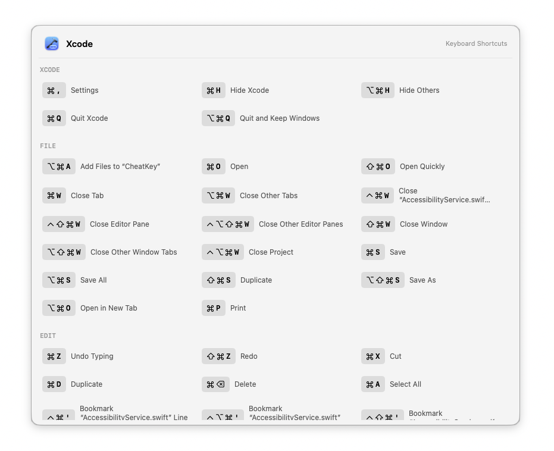

<p align="center">
  
</p>
<h1 align="center">ShortcutPeek</h1>

> ⌨️ A shortcut cheat sheet.

A macOS menu bar app that shows keyboard shortcuts for the current application — just hold `⌘`. 🚀

<p align="center">
  
</p>

## How it works

Hold the Command key for a moment, and ShortcutPeek reads the frontmost app's menu bar via Accessibility API, then displays a floating card with all available shortcuts grouped by menu category (File, Edit, View, etc.). Tap any shortcut to execute it.

## Features

- **Hold ⌘** — overlay appears after a configurable hold duration (Fast / Default / Slow)
- **Show Shortcuts…** — also available from the menu bar icon, with a close button
- **App switching** — overlay refreshes automatically when switching apps while holding ⌘
- **Launch at login** — optional, in settings
- **No AltTab interaction** — the overlay is a non-activating panel; clicking tiles sends keystrokes to the original app

## Requirements

- macOS 15.6+
- Accessibility permission (required for reading other apps' menu bars)

## How to install & run

ShortcutPeek is not signed with an Apple Developer ID, because developing free and open-source software doesn't pay for a $99/year Apple Developer Program membership. As a result, macOS may block the app from opening.

1. To run it, **double-click** the app in Finder, then confirm in the dialog:
2. Click **Done**
3. Open **System Settings** app, **Privacy & Security**, scroll down and find the **Open Anyway** button. 
4. Click **Open Anyway**
5. Use your **Touch ID** or enter your password to confirm.

## Building

```bash
xcodebuild -project ShortcutPeek.xcodeproj -scheme ShortcutPeek -configuration Release build
```

## Architecture

Feature-first vertical slices, Clean Architecture + MVVM. See [CLAUDE.md](./CLAUDE.md).

## License

[GNU General Public License v3.0](LICENSE.txt)
